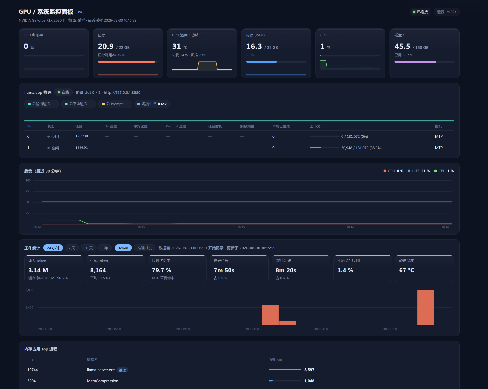

# gpu-panel

单文件 GPU / 系统 / llama.cpp 监控面板 —— NVIDIA + llama.cpp，Windows / Linux 双平台，无需前端构建。



## 特性

- **单文件零构建**：一个 `gpu_panel.py`，后端只依赖 `psutil`，前端 HTML/CSS/JS 内嵌、Canvas 手绘图表
- **采样分层**：llama.cpp `/slots` 每 2s（token 速度要快）；nvidia-smi + psutil 每 10s（重，放慢）
- **GPU 面板**：多卡支持，利用率 / 显存 / 温度 / 功耗 / 风扇；无 NVIDIA 卡时自动隐藏 GPU 卡片，只显示系统指标
- **llama.cpp 推理区**：每个 slot 的 3s 窗口速度 / 任务平均速度 / prompt 速度 / 任务时长 / 剩余预估 / 上下文占用，MTP 投机解码标记，全局总速度
- **长期工作统计**：`stats_log.jsonl` 每 60s 一拍、保留 1 年，聚合出 24 小时 / 7 天 / 30 天 / 1 年四档：
  - 输入 token（实际计算 + 缓存命中，命中率）
  - 生成 token（平均 t/s）
  - 投机解码接受率（MTP）
  - 推理忙碌时长 / GPU 活跃时长 / 平均 GPU 利用率 / 峰值温度
  - 柱状图分桶自适应（小时 / 天 / 周）+ 悬停提示 + 指标切换
- **llama-server 重启容错**：计数器变小视为重启，自动丢弃该段差分，统计不会被清零污染
- **其余**：30 分钟趋势图、sparkline、CSV 日志（可关）、断线保护、移动端适配、可选访问令牌

## 快速开始

```bash
pip install psutil
python gpu_panel.py            # 监听 0.0.0.0:8081，可传端口参数
```

浏览器打开 `http://127.0.0.1:8081/`。

- GPU 指标来自 `nvidia-smi`（需要 NVIDIA 驱动）
- 推理指标来自 llama.cpp 的 `llama-server`（`/slots`、`/metrics`），默认地址
  `http://127.0.0.1:8080`，可用环境变量 `LLM_URL` 覆盖

## 环境变量

| 变量 | 默认值 | 说明 |
|---|---|---|
| `LLM_URL` | `http://127.0.0.1:8080` | llama-server 地址 |
| `SAMPLE_INTERVAL` | `2` | llama.cpp / 历史采样周期（秒） |
| `SYS_INTERVAL` | `10` | GPU / 系统采样周期（秒） |
| `MAX_HISTORY` | `900` | 内存历史条数（≈30 分钟 @2s） |
| `CSV_INTERVAL` | `10` | CSV 落盘间隔（秒），`<=0` 关闭 CSV 日志 |
| `PANEL_TOKEN` | 空 | 设置后 `/api/*` 需要 `?token=xxx` 或 `Authorization: Bearer xxx` |

## 测试

```bash
python tests/test_stats_rebuild.py
```

离线回归测试：模拟 3 天数据 + 一次 llama-server 重启，断言各时间窗的 token / 忙碌时长 /
投机接受率 / 缓存命中聚合正确。改统计聚合逻辑后请跑一遍。

## 范围与扩展

只支持 **NVIDIA GPU + llama.cpp**。GPU 采样与 LLM 采样各自收拢为 adapter 类
（`NvidiaGpuSampler` / `LlamaCppSampler`），主逻辑只调接口 —— 未来支持 AMD/Intel GPU
或 Ollama/vLLM 时，加一个 adapter 并在 `_make_gpu_sampler()` / `_make_llm_sampler()`
里挑选即可，暂未实现。

## License

[MIT](LICENSE)
